# Image-Resolution-and-Reconstructing-using-Random-Fourier-Features-and-Advanced-Matrix-Techniques

### *Group:- Matrix Minds*

# Table of Contents
1. [Project Description](#project-description)
2. [Reconstruction of Images with Missing Patch of different sizes using Matrix Factorization and gradient descent as optimization technique](#reconstruction-of-images-with-missing-patch-of-different-sizes-using-matrix-factorization-and-gradient-descent-as-optimization-technique)
    1. [Rectangular block of size NxN is assumed to be missing from the image](#1-rectangular-block-of-size-nxn-is-assumed-to-be-missing-from-the-image)
    2. [Random subset of size NxN is assumed to be missing from the image](#2-random-subset-of-size-nxn-is-assumed-to-be-missing-from-the-image)
    3. [PSNR (Peak Signal-to-Noise Ratio)](#psnr-peak-signal-to-noise-ratio)
    4. [Root Mean Squared Error (RMSE)](#root-mean-squared-error-rmse)
3. [Using Least Squares Function for Matrix Factorization](#using-least-squares-function-for-matrix-factorization)
    1. [Rectangular block of size NxN is assumed to be missing from the image](#1-rectangular-block-of-size-nxn-is-assumed-to-be-missing-from-the-image-1)
    2. [Random subset of size NxN is assumed to be missing from the image](#2-random-subset-of-size-nxn-is-assumed-to-be-missing-from-the-image-1)
    3. [PSNR Graph of Randomly Removed Pixels and Missing Patch](#psnr-graph-of-randomly-removed-pixels-and-missing-patch)
    4. [RMSE Graph of Randomly Removed Pixels and Missing Patch](#rmse-graph-of-randomly-removed-pixels-and-missing-patch)

# Project Description:-

## Reconstruction of Images with Missing Patch of different sizes using Matrix Factorization and gradient descent as optimization technique

### ***Matrix Factorization***
- Matrix factorization is a powerful technique used to decompose a matrix into the product of two or more smaller matrices. This method is widely applied in machine learning and data analysis for various purposes such as dimensionality reduction, discovering latent features, and making predictions. In the context of image reconstruction, matrix factorization can effectively approximate the missing pixels in an image. By decomposing the image matrix into two lower-rank matrices, we can reconstruct the missing pixels based on the information captured in these factorized matrices.

### ***Use of Gradient Descent as Optimization Technique***
- Gradient descent is a fundamental optimization algorithm used to minimize the loss function during the process of matrix factorization for image reconstruction. Here’s how it works step-by-step:
    1. ***Initialization:-*** Two matrices 𝑊𝑟 and 𝐻𝑟 are initialized randomly. These matrices are of dimensions that facilitate the factorization of the original image matrix 𝐴 into a product 𝑊𝐻.

    2. ***Loss calculation:-*** 
        - The loss function is defined as:
        $$
        \text{loss} = \left\|{A} - {W_r} \times {H_r}\right\|_F + \lambda_{\text{reg}} \cdot (\|W_r\| + \|H_r\|)
        $$

        - diff_vector represents the vector of differences between the reconstructed matrix 𝑊𝐻 and the original matrix 𝐴, only considering the non-missing pixels (masked as ∼isnan(𝐴)).

        - $\lambda_{\text{reg}}$ is a regularization parameter that penalizes large values in 𝑊𝑟 and 𝐻𝑟 to prevent overfitting.

        - The $||.||$ denotes the Frobenius norm for matrices, which measures the magnitude of matrices similarly to the Euclidean norm for vectors.

    3. ***Optimization:-***
        - The Adam optimizer is used to minimize the loss function. Adam is an adaptive learning rate optimization algorithm that combines ideas from RMSProp and Momentum, making it suitable for noisy environments like training neural networks.
        - The optimizer adjusts the parameters 𝑊𝑟 and 𝐻𝑟 iteratively using the gradients computed during backpropagation.
        - Backpropagation involves computing the gradients of the loss function with respect to 𝑊𝑟 and 𝐻𝑟, which indicates how to update 𝑊𝑟 and 𝐻𝑟 to reduce the loss.

### 1. **Rectangular block of size NxN is assumed to be missing from the image:**

- **Region of 20x20:**
    
    

- **Region of 40x40:**
    
    

- **Region of 60x60:**
    
    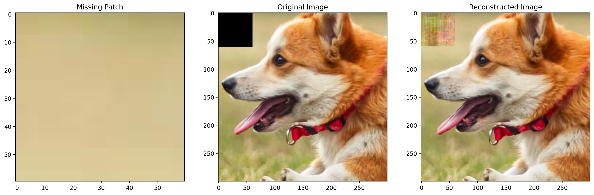

- **Region of 80x80:**
    
    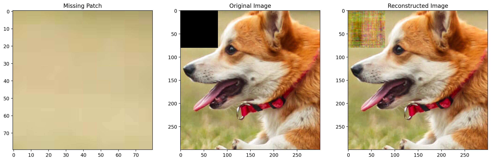

    ### *Observation*
    - As we increase the size N of the patch to be removed while keeping the rank r constant, the reconstruction quality tends to deteriorate. This is because with a larger patch size, there's a greater proportion of missing pixels within the image. This creates a larger area of missing information, making it more difficult for the algorithm to accurately fill in the gaps. Additionally, as the patch size increases, the algorithm has to interpolate a greater number of missing pixels, which reduces the amount of contextual information available from neighboring pixels. Consequently, the reconstruction becomes poorer in the region of the removed pixels, as the algorithm struggles to capture the complex patterns and structures present in the image. However, it's important to note that the reconstruction quality remains good in the regions of the image that are not affected by the removal of pixels.

### 2. **Random subset of size NxN is assumed to be missing from the image:**

- **Region of 20x20:**
    
    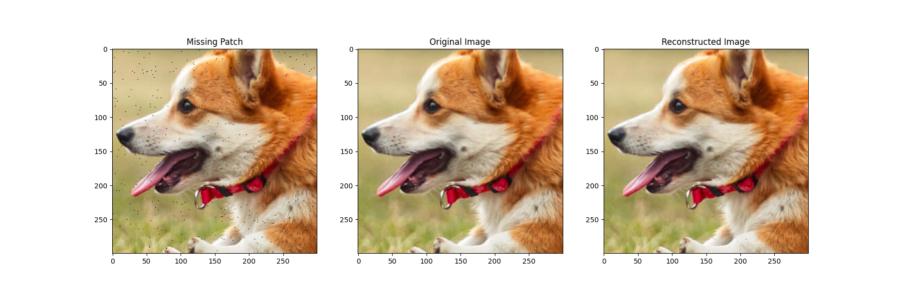

- **Region of 40x40:**
    
    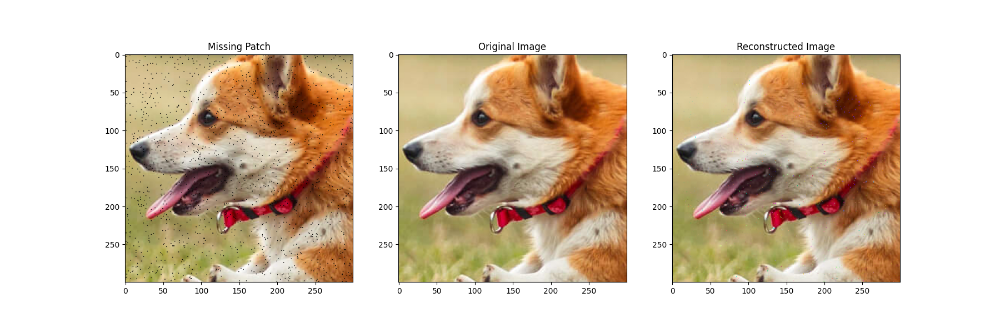

- **Region of 60x60:**
    
    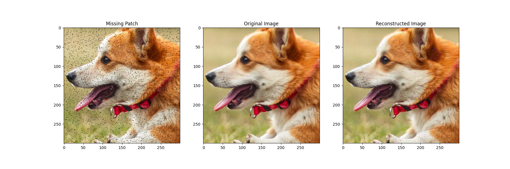

- **Region of 80x80:**
    
    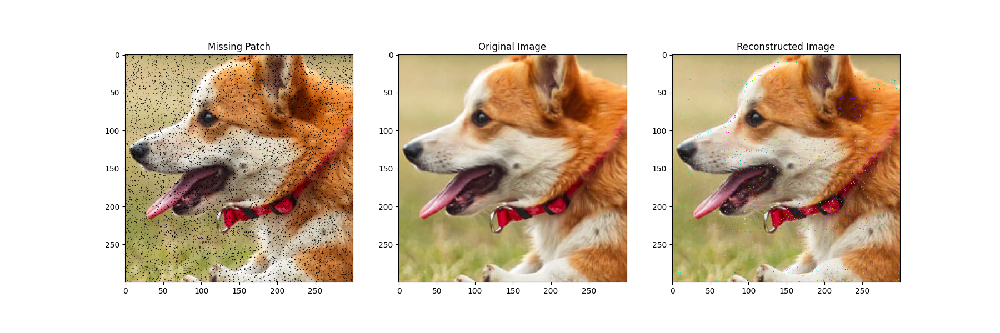

    ### *Observation*
    - When a random subset of pixels is removed from the image, the reconstruction quality is relatively stable across different sizes of the removed subset. This is because the algorithm can leverage the contextual information from the surrounding pixels to fill in the missing values. Even with larger subsets of missing pixels, the algorithm can still make accurate predictions based on the available information in the image. As a result, the reconstruction quality remains consistent, and the missing pixels are filled in effectively without significant loss of image fidelity. The algorithm is able to capture the underlying patterns and structures in the image, leading to a high-quality reconstruction even with a substantial portion of pixels missing.
## PSNR (Peak Signal-to-Noise Ratio)

PSNR is a measure used to assess the quality of a reconstructed or compressed image relative to the original image. It quantifies the ratio between the maximum possible power of a signal and the power of the noise that affects the fidelity of its representation.

### Formula
The formula for PSNR is:

$$
\text{PSNR} = 10 \cdot \log_{10} \left( \frac{{\text{MAX}^2}}{{\text{MSE}}} \right)
$$

Where:
- **MAX**: Maximum possible pixel value of the image (e.g., 255 for an 8-bit grayscale image).
- **MSE**: Mean Squared Error, calculated as the average of the squared differences between corresponding pixels in the original and reconstructed images.

### Interpretation
PSNR is typically expressed in decibels (dB). A higher PSNR value indicates higher image quality, meaning less distortion or noise in the reconstructed image compared to the original.

### PSNR Graph of Randomly Removed Pixels and Missing Patch

    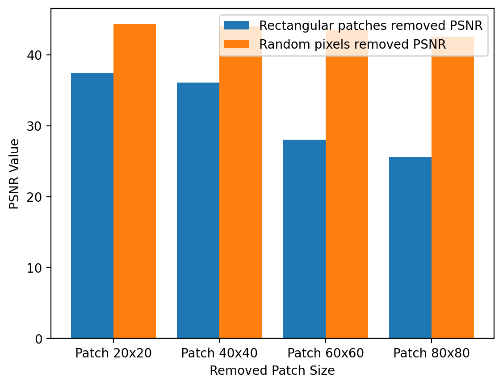

- **Observation**:From the PSNR graph comparing randomly removed points and patch removed points, we observe that the PSNR value for randomly removed points is higher. As we increase the size of the removed points (NxN) from 20 to 80, the PSNR value decreases slightly. However, for patch removed points, the PSNR value for subsequent sizes is smaller compared to randomly removed points. Moreover, as we increase the size (N) of the removed patch, the PSNR value decreases significantly, indicating poorer reconstruction quality.

- **Conclusion**:

    1. Randomly removing points results in higher PSNR values, indicating better reconstruction quality compared to patch removal.

    2. Increasing the size of the removed patch leads to a significant decrease in PSNR values compare to randomly removed points, suggesting a notable decline in reconstruction quality.

## Root Mean Squared Error (RMSE)

RMSE, or Root Mean Squared Error, is a metric used to measure the average difference between corresponding pixel intensities in the original image and the reconstructed image. It provides a single numerical value that quantifies the overall discrepancy between the two images.

### Formula
The formula for RMSE is:

$$
RMSE = \sqrt{\frac{1}{N} \sum_{i=1}^{N} (I_{\text{orig}}(i) - I_{\text{recon}}(i))^2}
$$

Where:
- **N**: Total number of pixels in the image.
- **I_orig(i)**: Intensity of the i-th pixel in the original image.
- **I_recon(i)**: Intensity of the i-th pixel in the reconstructed image.

### Interpretation
- **Lower RMSE**: A lower RMSE value indicates that the reconstructed image closely matches the original image, with minimal differences between pixel intensities. This suggests a high level of accuracy in the reconstruction process and reflects a high-quality reconstruction.
  
- **Higher RMSE**: Conversely, a higher RMSE value indicates a greater discrepancy between the original and reconstructed images. This suggests that the reconstruction process has not accurately captured the details or patterns present in the original image, resulting in a lower-quality reconstruction.

### RMSE Graph of Randomly Removed Pixels and Missing Patch

    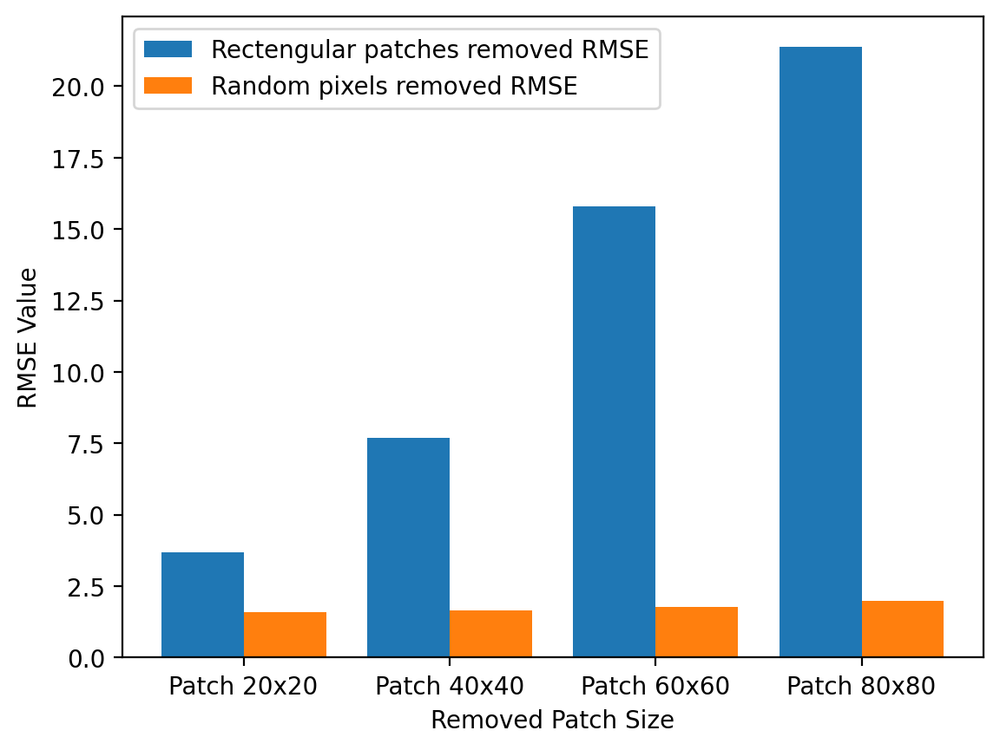

- **Observation**: From the RMSE plots comparing patch (NxN) removed and randomly removed points (of size NxN), it's evident that the RMSE value for the patch removed is higher than for randomly removed points. As we increase the size (N) of the removed patch, the RMSE value increases significantly, indicating a substantial deterioration in reconstruction quality. On the other hand, for randomly removed points, the RMSE value remains almost constant as N increases. This suggests that the reconstruction quality for randomly removed points is relatively stable across different sizes, whereas the reconstruction quality for patch removed points deteriorates significantly as the size of the removed patch increases.

- **Conclusion**:

    1. Patch removal results in poorer reconstruction quality compared to randomly removed points.

    2. Larger removed patch sizes lead to significantly higher RMSE values, emphasizing the detrimental effect of larger missing areas on reconstruction quality.

***Using Least Squares Function for Matrix Factorization***
- In matrix factorization, we aim to decompose the original image matrix 𝐴 into two smaller matrices, 𝑊 and 𝐻. These matrices are initialized with random values. The goal is to minimize the reconstruction error, which is the difference between the original image matrix 𝐴 and the product of the two smaller matrices 𝑊𝐻.
- The reconstruction error is defined as the Frobenius norm of the difference between the original image matrix 𝐴 and the product of the factorized matrices 𝑊 and 𝐻. Mathematically, this can be expressed as:
$$ 
\text{Reconstruction Error} = \left\|\mathbf{A} - \mathbf{W} \times \mathbf{H}\right\|_F
$$

- To achieve this, we employ gradient descent as the optimization technique. The process involves the following steps:
    1. ***Initialization:-*** Start by initializing the values of matrices 𝑊 and 𝐻 with random numbers drawn from a normal distribution.
    2. ***Optimization:-***
        - *Fix Matrix 𝐻:-* Keeping the values of matrix 𝐻 constant, perform gradient descent on matrix 𝑊. This involves updating the values of 𝑊 iteratively to minimize the reconstruction error.

        - *Fix Matrix 𝑊:-* Next, keep the updated values of matrix 𝑊 constant and perform gradient descent on matrix 𝐻. Similarly, update the values of 𝐻 iteratively to minimize the reconstruction error.
    3. ***Iteration:-*** Repeat the above steps alternately for a predefined number of iterations or until the reconstruction error converges to a satisfactory level.
- By iteratively updating the values of 𝑊 and 𝐻 through gradient descent, we can effectively minimize the reconstruction error. This optimization process allows us to accurately reconstruct the missing pixels in the image, leveraging the latent features captured by the factorized matrices.

### 1. **Rectangular block of size NxN is assumed to be missing from the image:**

- **Region of 20x20:**
    
    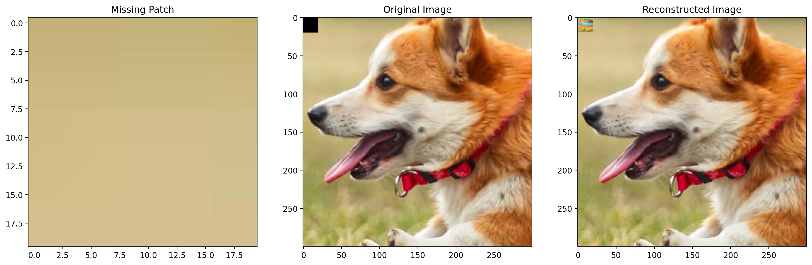

- **Region of 40x40:**
    
    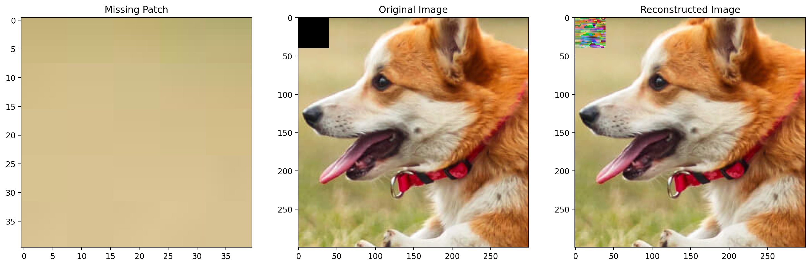

- **Region of 60x60:**
    
    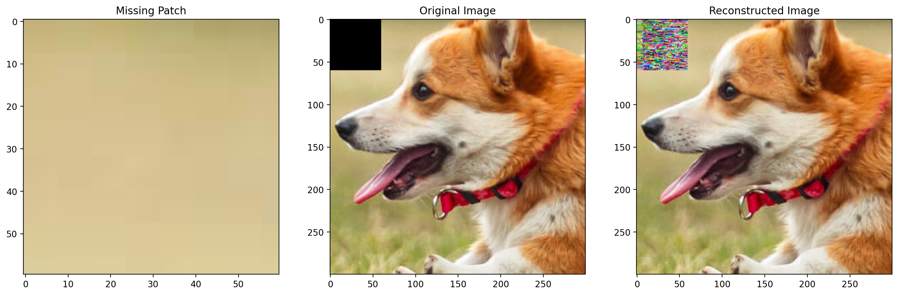

- **Region of 80x80:**
    
    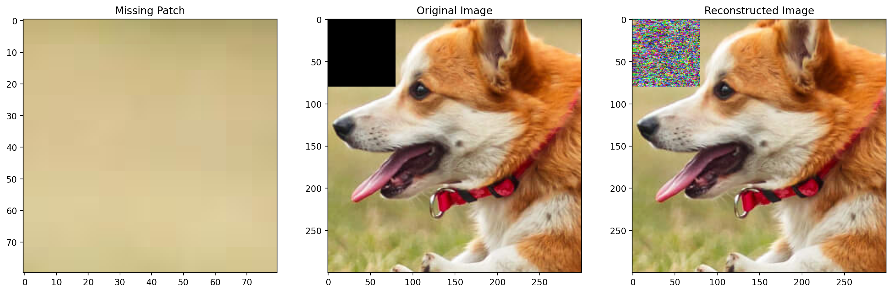

### 2. **Random subset of size NxN is assumed to be missing from the image:**

- **Region of 20x20:**
    
    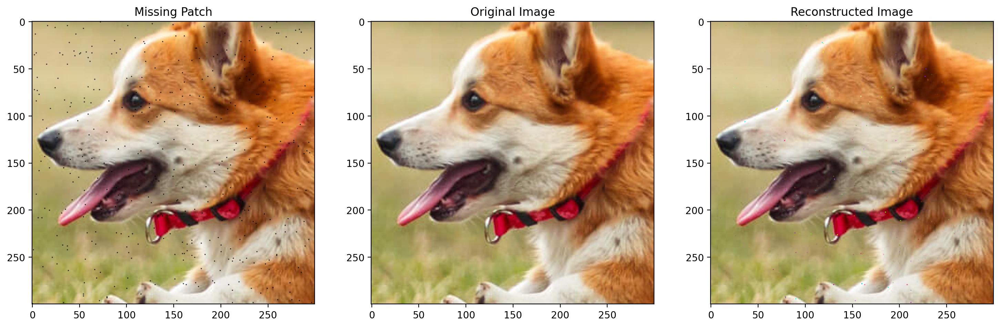

- **Region of 40x40:**
    
    

- **Region of 60x60:**
    
    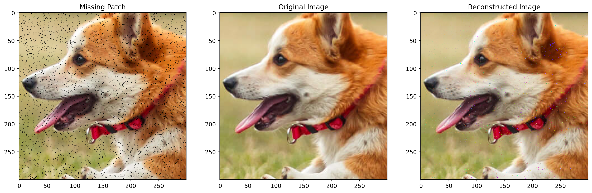

- **Region of 80x80:**
    
    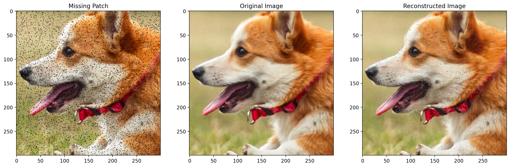

    ### *Observation* 
    - Here, we can see from the image that the reconstructed least square method is not so good and it is not giving exact image. This is happening because of the fact that the alternating least square method just tries to minimize the error between the original image with patch removed in it and the reconstructed image. But, it does not take into account the missing patch and tries to fit the rest of the image without it. This is the reason why the reconstructed image is not so good. So from the image you can see that the prediction made for missing part of the image is not that much good and it is not able to predict the exact image.

    - Due to overfitting we see that this method does not predict the trend properly because of overfitting and as you can notice the part which was not cut was predicted very good and this is happening because only that part is going under training and we are predicting the values for the missing part but when we give the training part to the least square function with high number of features then it tries to fit the training data very well and hence it overfits the data and hence the prediction is not good. So we tried to decrease the number of features but in that case the the whole image coming out was not good so we kept the number of features to the current value where it was giving the best result.

    - Also, the time taken by the alternating least square method is very high as compared to the gradient descent method. This is because the alternating least square method is not so efficient and it takes a lot of time to converge to the optimal solution as we seen during the lectures that gradient descent is very fast as compared to the alternating least square method.

    - However the iteration needed to converge are very less because in each iteration it gives most optimal W and H that fits the image with missing patch very well and there is very negligible decrease in loss after 2-3 iterations.  

### PSNR Graph of Randomly Removed Pixels and Missing Patch

    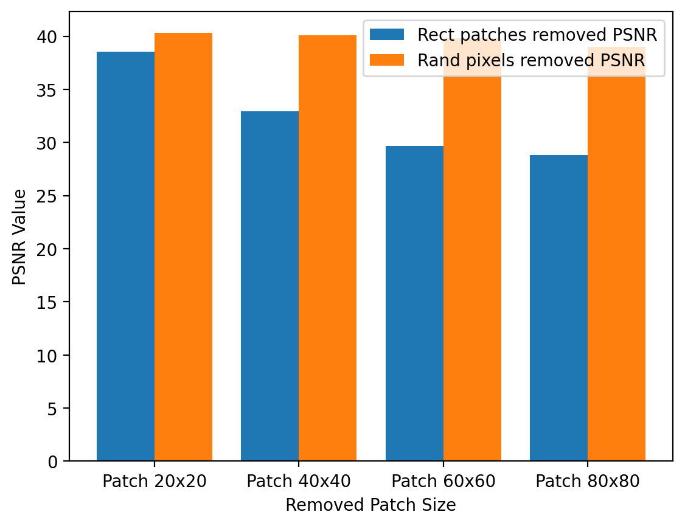

- ***Observation:*** From the PSNR graph comparing randomly removed points and patch removed points, we observe that the PSNR value for randomly removed points is higher. As we increase the size of the removed points (NxN) from 20 to 80, the PSNR value decreases slightly. However, for patch removed points, the PSNR value for subsequent sizes is smaller compared to randomly removed points. Moreover, as we increase the size (N) of the removed patch, the PSNR value decreases significantly, indicating poorer reconstruction quality.

- ***Conclusion:***
    1. Randomly removing points results in higher PSNR values, indicating better reconstruction quality compared to patch removal.
    2. Increasing the size of the removed patch leads to a significant decrease in PSNR values compared to randomly removed points, suggesting a notable decline in reconstruction quality.

### RMSE Graph of Randomly Removed Pixels and Missing Patch

    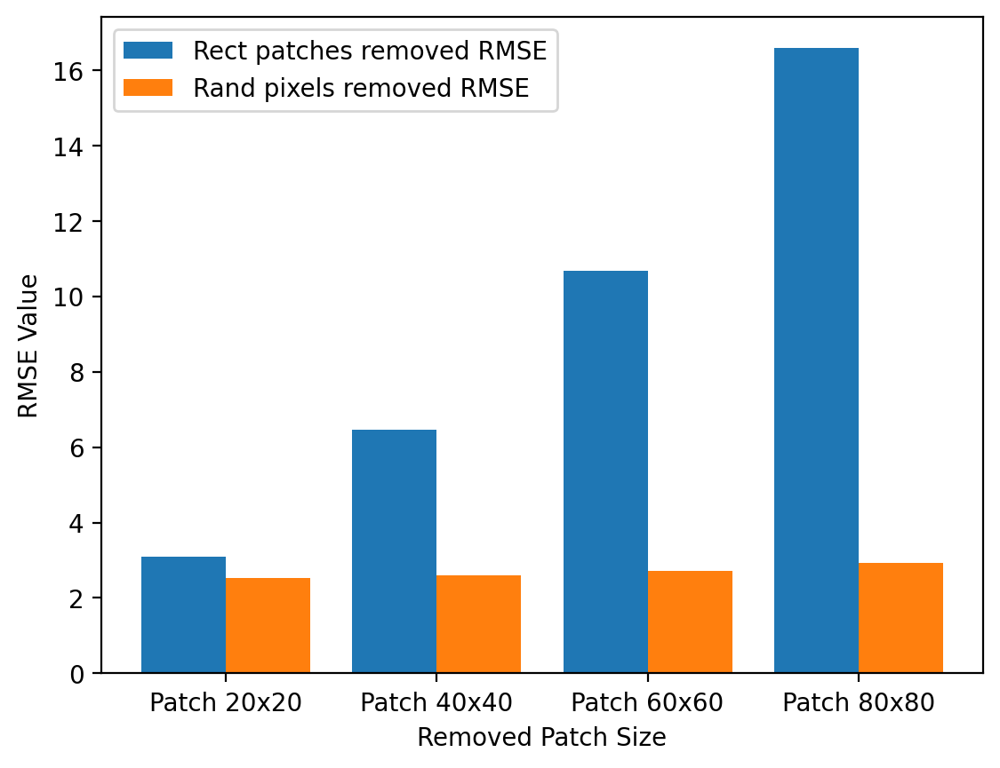

- ***Observation:*** From the RMSE plots comparing patch (NxN) removed and randomly removed points (of size NxN), it's evident that the RMSE value for the patch removed is higher than for randomly removed points. As we increase the size (N) of the removed patch, the RMSE value increases significantly, indicating a substantial deterioration in reconstruction quality. On the other hand, for randomly removed points, the RMSE value remains almost constant as N increases. This suggests that the reconstruction quality for randomly removed points is relatively stable across different sizes, whereas the reconstruction quality for patch removed points deteriorates significantly as the size of the removed patch increases.

- ***Conclusion:***
    1. Patch removal results in poorer reconstruction quality compared to randomly removed points.
    2. Larger removed patch sizes lead to significantly higher RMSE values, emphasizing the detrimental effect of larger missing areas on reconstruction quality.

## Image Resolution using Random Fourier Features and linear regression

### ***Random Fourier Features (RFF) and linear regression***
- Random Fourier Features (RFF) approximate the feature map of a kernelized function by projecting input data using random Fourier basis functions. This enables efficient computation of complex kernel functions without explicitly evaluating them in the original space. In the context of image resolution, RFF can enhance and super-resolve images by predicting pixel values in between existing ones. By transforming the low-resolution image data, we can apply linear regression to estimate the values of the high-resolution image pixels.